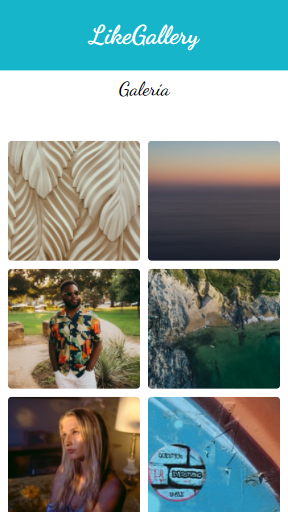

# LikeGallery

## Descripción 📋

El Proyecto es una galería de fofos **LikeGallery** totalmente responsive,  elaborado con JavaScript y CSS, para las fotos consumio la API de Unsplash.
Unsplash es un Página web en la cual puedes encontrar muchas imágenes de alta calidad las cuales son libres de derechos de autor. 🎉

## Herramientas 🛠️

* [Visual Studio](https://visualstudio.microsoft.com/es/) - IDE
* [JSON](https://www.ibm.com/docs/es/baw/20.x?topic=formats-javascript-object-notation-json-format) - Data
* [Git](https://git-scm.com/) - Control de Versiones
* [Unsplash](https://unsplash.com/) - API Unsplash

### LikeGallery - [Pruébala aquí..](https://likegallery.netlify.app/)

